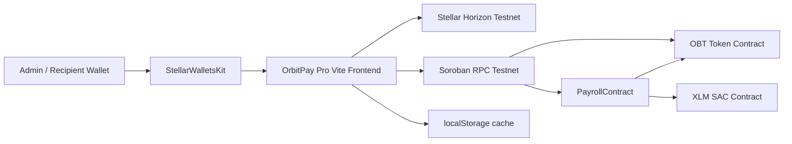
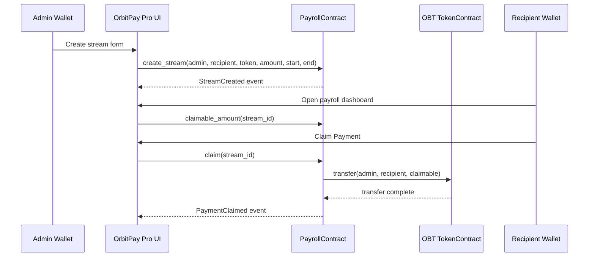

# OrbitPay Pro Architecture

OrbitPay Pro extends the existing OrbitPay Stellar dashboard into a decentralized payroll and streaming payments MVP. The app keeps the current wallet, token, payment, and poll flows, then adds an OBT faucet and a PayrollContract for vesting-style payment streams.

## System Overview



## Contract Interaction Flow

1. The user connects Freighter, xBull, Albedo, or Hana through StellarWalletsKit.
2. The dashboard reads XLM from Horizon and OBT from the OBT token contract.
3. The faucet builds an OBT `mint(to, amount)` transaction and asks the connected wallet to sign.
4. The payroll admin creates a stream with recipient, amount, duration, token contract, and token type.
5. The recipient calls `claim(stream_id)` whenever vested funds are available.
6. PayrollContract calculates vested minus claimed funds, then calls the selected token contract's `transfer(admin, recipient, claimable)`.
7. Admin controls call `pause(stream_id)`, `resume(stream_id)`, or `cancel(stream_id)`.

## Frontend Component Tree

```text
index.html
|-- Landing overlay
|-- Sidebar navigation
|   |-- Dashboard
|   |-- Send XLM / OBT
|   |-- Payroll
|   |-- Community Poll
|   |-- History
|   `-- Settings
`-- Page container
    |-- Dashboard cards
    |   `-- OBT mint faucet
    |-- Payment form
    |-- Payroll dashboard
    |   |-- Create stream form
    |   |-- Recipient claim panel
    |   |-- Admin active streams
    |   `-- Claim history
    |-- Poll view
    `-- Transaction history
```

## Data Flow



## Contracts

| Contract | Purpose | Address |
|---|---|---|
| OBT TokenContract | Custom OrbitToken mint, balance, and transfer operations | `CDLZFC3SYJYDZT7K67VZ75HPJVIEUVNIXF47ZG2FB2RMQQVU2HHGCN3` |
| PollContract | Existing on-chain voting with OBT balance gate | `CAKINUZ4GVF6IB56H26YCJ64OUHJNXZMXWF3SXNLO6PQYYGYIGRS52UC` |
| PayrollContract | Streaming payroll, claim, pause, resume, cancel, and token transfers | `PAYROLL_CONTRACT_ID_PENDING_DEPLOYMENT` |

## Storage

The blockchain remains the source of truth for balances and stream actions. The UI also caches wallet address, balances, recent transactions, and recently created payroll stream metadata in `localStorage` to keep the dashboard responsive between refreshes.
