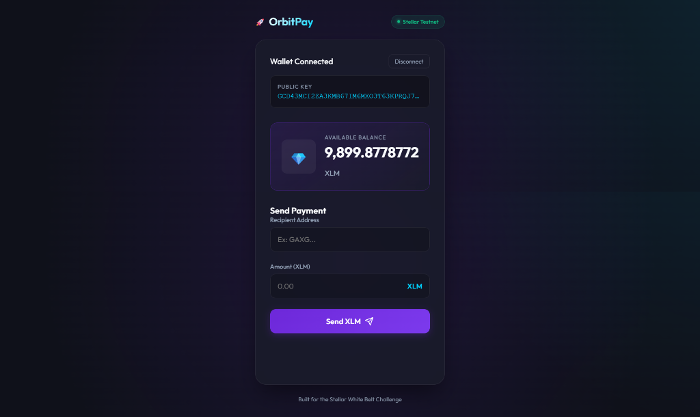
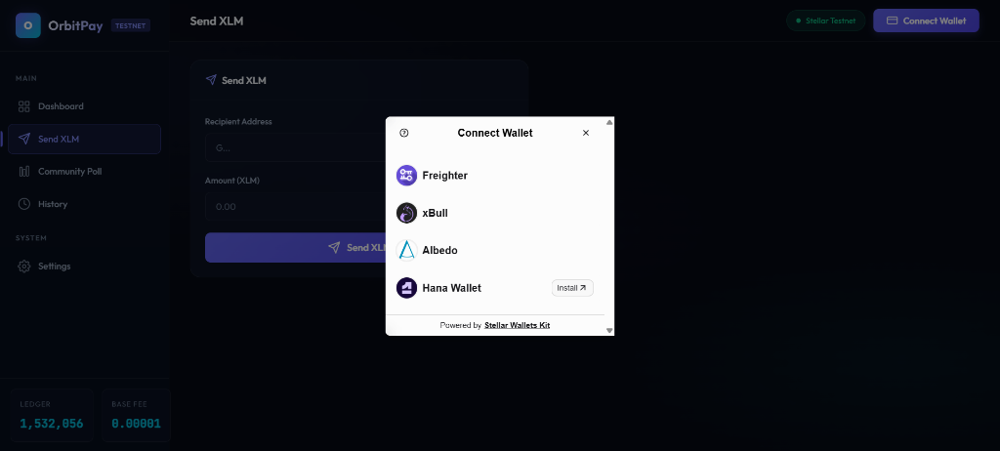
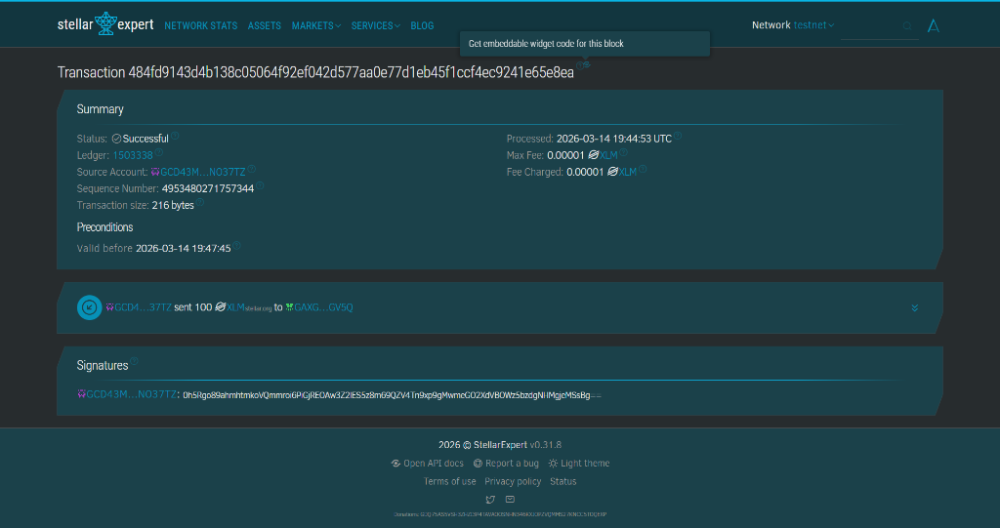
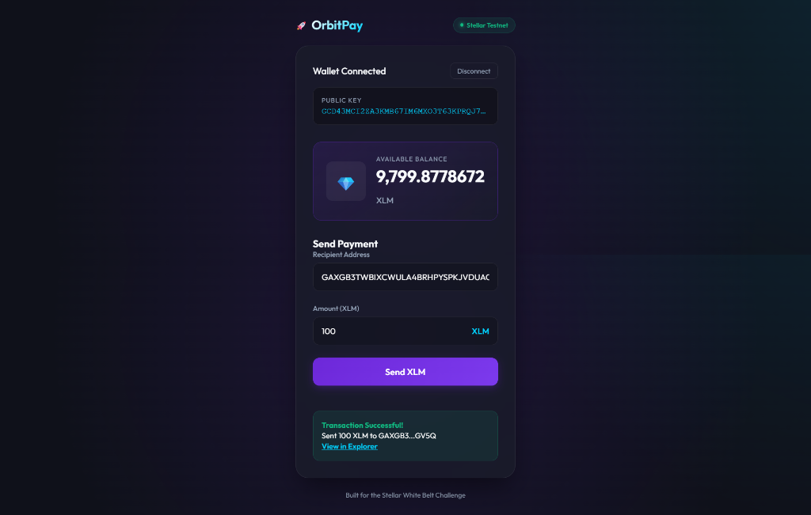

# 🚀 OrbitPay | Stellar FinTech Dashboard


> A premium Stellar dApp built for the **Stellar Yellow Belt (Level 2)** Challenge on Rise In. Features multi-wallet integration, on-chain voting, real-time transaction tracking, and a FinTech-grade UI.

🚀 **Live Demo:** [https://orbit-pay-seven.vercel.app/](https://orbit-pay-seven.vercel.app/)

---

## ✨ Features

| Feature | Description |
|---|---|
| 🔗 **Multi-Wallet Connect** | Freighter, xBull, Albedo, and Hana via Stellar Wallets Kit v2 |
| 📊 **Community Poll** | Vote on-chain using a deployed Soroban smart contract |
| 💸 **Send XLM** | Build, sign, and broadcast payments with 3-phase status tracking |
| 📜 **Transaction History** | Last 10 transactions from Horizon with type, amount, and explorer links |
| 🔔 **Toast Notifications** | Color-coded alerts (success/error/warning/info) with auto-dismiss |
| 📱 **QR Code Sharing** | One-click QR modal for sharing your wallet address |
| 📋 **Copy Address** | Instant clipboard copy with confirmation toast |
| 🌐 **Network Stats** | Live ledger number and base fee from Horizon |
| ⚠️ **Error Handling** | Invalid address, insufficient balance, wallet not found/rejected |
| 📱 **Responsive** | Full mobile support with collapsible sidebar navigation |

---

## 📜 Deployed Contract & Checklist

| | |
|---|---|
| **Contract ID** | `CAKINUZ4GVF6IB56H26YCJ64OUHJNXZMXWF3SXNLO6PQYYGYIGRS52UC` |
| **Network** | Stellar Testnet |
| **Deploy TX Hash** | `099a579d80eb39a85ce78e9d601568cba1033bba2f090f47faba448a0651abe6` |
| **Contract Call Hash**| `[REPLACE_WITH_YOUR_VOTE_TX_HASH]` *(Requirement: Hash of a contract call)* |
| **Explorer** | [View on Stellar Expert](https://stellar.expert/explorer/testnet/tx/099a579d80eb39a85ce78e9d601568cba1033bba2f090f47faba448a0651abe6) |
| **Contract** | [View on Stellar Lab](https://lab.stellar.org/r/testnet/contract/CAKINUZ4GVF6IB56H26YCJ64OUHJNXZMXWF3SXNLO6PQYYGYIGRS52UC) |

---

## 🛠️ Tech Stack

- **Frontend**: HTML5, CSS3, Modern JavaScript (ES Modules)
- **Build Tool**: [Vite 5](https://vitejs.dev)
- **Wallet**: [@creit.tech/stellar-wallets-kit](https://github.com/nicodemus-tech/stellar-wallets-kit) v2
- **Blockchain**: [Stellar SDK](https://www.npmjs.com/package/stellar-sdk) + Horizon API
- **Smart Contract**: [Soroban](https://soroban.stellar.org) (Rust → WASM)
- **Font**: [Outfit](https://fonts.google.com/specimen/Outfit) + [JetBrains Mono](https://fonts.google.com/specimen/JetBrains+Mono)

---

## 📁 Project Structure

```
stellar-payment-dapp/
├── index.html              # Main HTML with sidebar layout
├── style.css               # Complete design system (CSS custom properties)
├── app.js                  # Main orchestrator (imports modules)
├── js/
│   ├── wallet.js           # Stellar Wallets Kit v2 wrapper
│   ├── toast.js            # Toast notification system
│   └── utils.js            # Helpers (truncate, format, QR, clipboard)
├── contracts/
│   └── poll/
│       ├── src/
│       │   ├── lib.rs      # Soroban smart contract (vote/results)
│       │   └── test.rs     # Unit tests
│       └── Cargo.toml      # Rust dependencies
├── package.json
├── vite.config.js
└── README.md
```

---

## 🚀 Setup & Run

### Prerequisites
- [Node.js](https://nodejs.org/) v18+
- A Stellar wallet extension ([Freighter](https://freighter.app), xBull, or Albedo)

### Quick Start
```bash
# 1. Clone the repository
git clone https://github.com/ShivamSoni20/OrbitPay.git
cd OrbitPay/stellar-payment-dapp

# 2. Install dependencies
npm install

# 3. Start the dev server
npm run dev

# 4. Open http://localhost:5173 in your browser
```

### Build for Production
```bash
npm run build
npm run preview
```

---

## 📸 Screenshots

### Dashboard
<p align="center">
  
</p>
*Premium dark-themed FinTech dashboard with balance cards, network stats, and recent transactions.*

### Multi-Wallet Connect
<p align="center">
  
</p>
*Wallet selection modal supporting Freighter, xBull, Albedo, and Hana.*

### Community Poll
<p align="center">
  
</p>
*Animated vote bars with percentages, vote counts, and "You voted" badges.*

### Transaction History / Explorer
<p align="center">
  
</p>
*Chronological list of sent/received transactions with amounts and explorer links.*

---

## 📄 License
This project is open-source and available under the [MIT License](LICENSE).

---

<p align="center">
  Built with 💜 for the <strong>Stellar Yellow Belt Challenge</strong>
</p>
