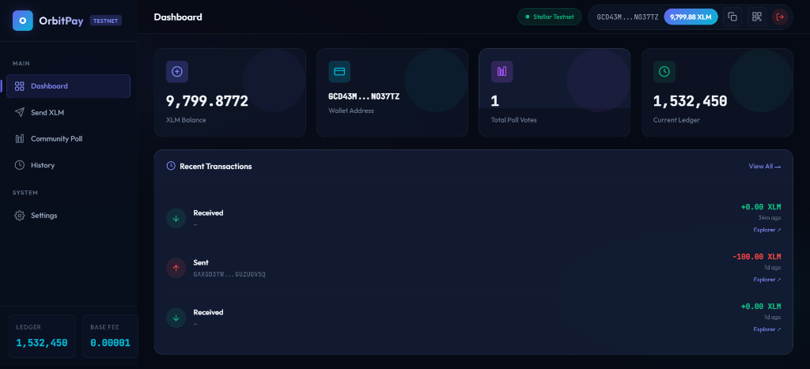
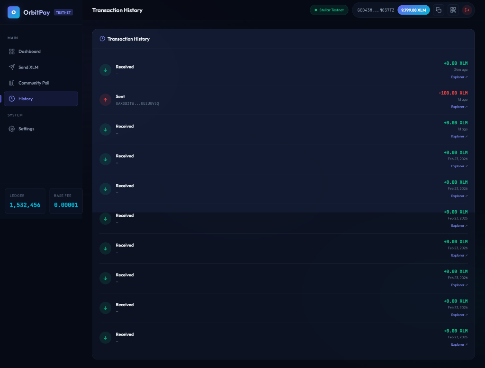

# 🚀 OrbitPay | Stellar FinTech Dashboard (v3.0)


> A premium Stellar dApp built for the **Stellar Orange Belt (Level 3)** Challenge on Rise In. Features multi-wallet integration, on-chain voting, real-time transaction tracking, and persistence via local caching.

🚀 **Live Demo:** [https://orbit-pay-seven.vercel.app/](https://orbit-pay-seven.vercel.app/)

---

## ✨ Features (Level 3 Upgrade)

| Feature | Description |
|---|---|
| 🔗 **Multi-Wallet Connect** | Freighter, xBull, Albedo, and Hana via Stellar Wallets Kit v2 |
| 📊 **Community Poll** | Vote on-chain using a deployed Soroban smart contract |
| 💸 **Send XLM** | Build, sign, and broadcast payments with 3-phase status tracking |
| ⏳ **Loading States** | Sophisticated progress indicators for wallet connection, contract calls, and submission |
| 💾 **Basic Caching** | Persistence of wallet balance and transaction history via `localStorage` |
| 🧪 **Automated Testing** | Unit tests covering logic, error handling, and UI components using Vitest |
| 📜 **Transaction History** | Last 10 transactions from Horizon with type, amount, and explorer links |
| 🔔 **Toast Notifications** | Color-coded alerts with auto-dismiss and progress bars |
| 📋 **QR & Copy** | Share wallet addresses with one-click QR modal |
| 📱 **Responsive** | Full mobile support with glassmorphism design |

---

## 📜 Deployed Contract & Checklist

| | |
|---|---|
| **Contract ID** | `CAKINUZ4GVF6IB56H26YCJ64OUHJNXZMXWF3SXNLO6PQYYGYIGRS52UC` |
| **Network** | Stellar Testnet |
| **Deploy TX Hash** | `099a579d80eb39a85ce78e9d601568cba1033bba2f090f47faba448a0651abe6` |
| **Contract Call Hash**| `03845abf148f7fd6cc50900f2cfe82ba579f637fd646adb6fa7b37223d223344` |
| **Demo Video** | [Watch 1-Minute Demo](Placeholder-Link-to-Video) |

---

## 🧪 Testing (3+ Tests Passing)

We use **Vitest** for unit and component testing.

| Test Mode | Description | Status |
|---|---|---|
| **Contract Logic** | Mocked simulation calls with RPC response handling | ✅ Passed |
| **Error Handling** | Validating fallback behavior and invalid input handling | ✅ Passed |
| **UI Component** | Testing toast notification rendering in JSDOM environment | ✅ Passed |

```bash
# Run the test suite
npm run test
```

---

## 📁 Project Structure

```
stellar-payment-dapp/
├── index.html              # Main UI with sidebar layout
├── style.css               # Design system with L3 Loaders & Shimmers
├── app.js                  # Main orchestrator (Caching & Loading logic)
├── tests/                  # Level 3 Test Suite (Vitest)
│   ├── utils.test.js       # Logic and error handling
│   ├── ui.test.js          # DOM/UI Component tests
│   └── contract.test.js    # Mocked contract interaction tests
├── js/
│   ├── wallet.js           # Wallets Kit wrapper
│   ├── contract.js         # Soroban contract interaction
│   └── toast.js            # Notification system
├── package.json            # Dependencies and scripts (L3 Ready)
└── README.md
```

---

## 🚀 Setup & Run

### 1. Install Dependencies
```bash
npm install
```

### 2. Run Tests
```bash
npm run test
```

### 3. Start Development
```bash
npm run dev
```

---

## 📸 Screenshots

### Dashboard & Loading States
<p align="center">
  
</p>

### Automated Test Results
<p align="center">
  
</p>
*Note: Replace with real test result screenshot for final submission.*

---

## 📄 License
This project is open-source and available under the [MIT License](LICENSE).

---

<p align="center">
  Built with 💜 for the <strong>Stellar Orange Belt Challenge</strong>
</p>
