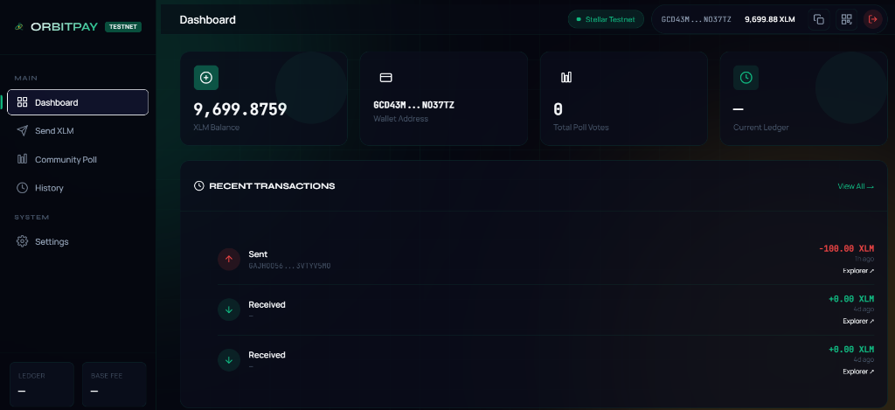
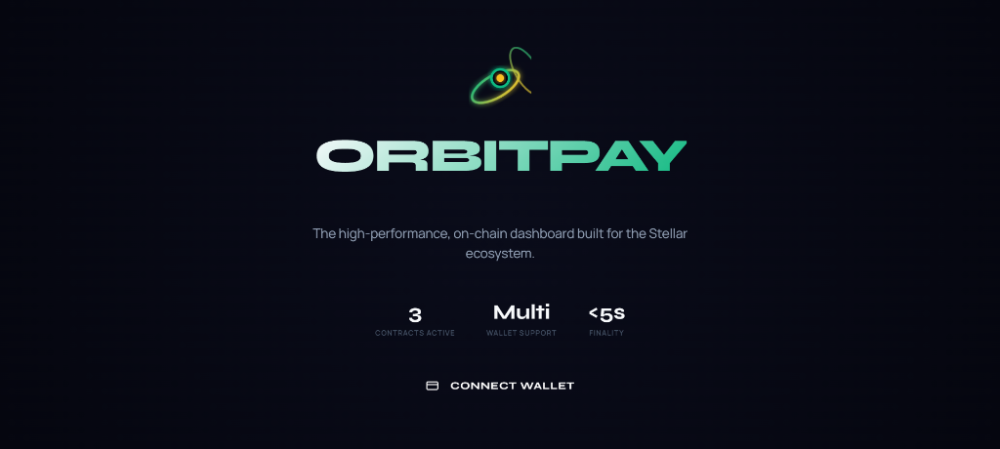
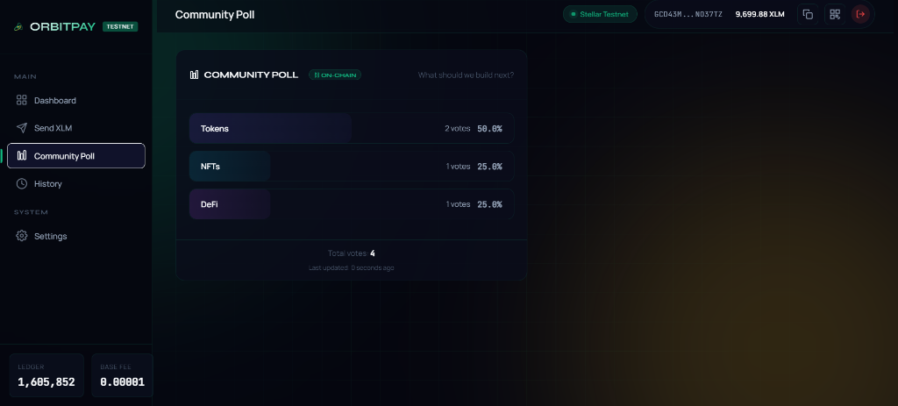
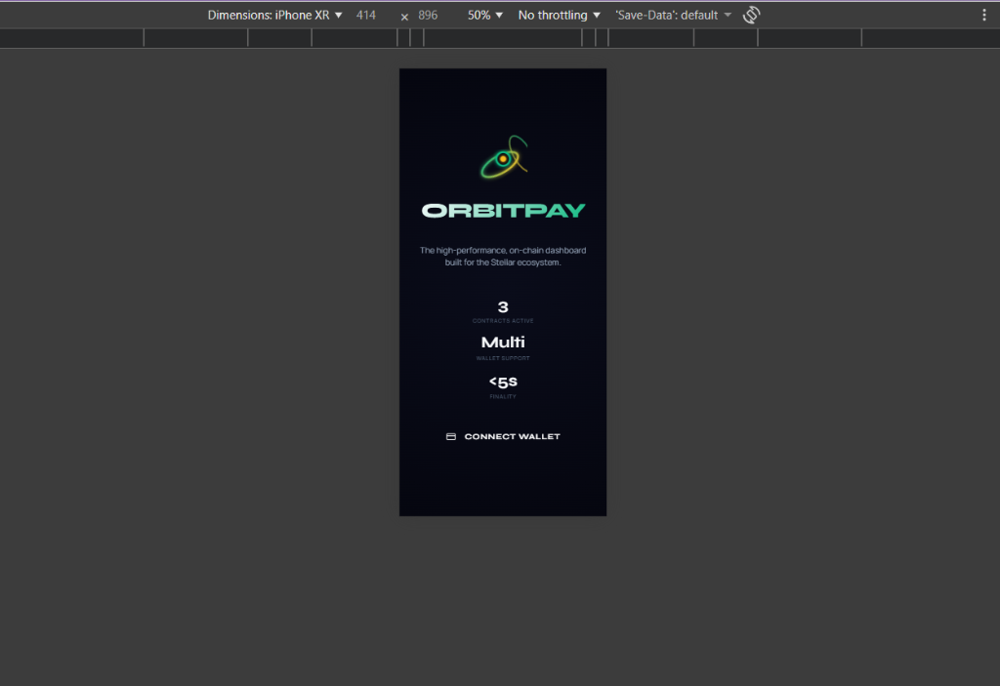

# 🚀 OrbitPay | Stellar FinTech Dashboard (v4.0)


> A premium Stellar dApp upgraded for the **Stellar Green Belt (Level 4)** Challenge on Rise In. Features a custom Soroban token (OBT), production-ready CI/CD pipelines, and full mobile optimization.

🚀 **Live Demo:** [https://orbit-pay-seven.vercel.app/](https://orbit-pay-seven.vercel.app/)


---

## ✨ Features (Level 3 Upgrade)

| Feature | Description |
|---|---|
| 🔗 **Multi-Wallet Connect** | Freighter, xBull, Albedo, and Hana via Stellar Wallets Kit v2 |
| 🪙 **Custom Token (OBT)** | **Green Belt:** Mint, transfer, and track a custom Soroban token |
| 🏗️ **CI/CD Pipeline** | **Green Belt:** Automated Vitest suite on every push via GitHub Actions |
| 📱 **Mobile First** | **Green Belt:** Fully fluid responsive UI from 375px up |
| 📊 **Community Poll** | Vote on-chain using a deployed Soroban smart contract |
| 💸 **Send XLM & OBT** | Built-in asset selector for native and custom asset transfers |
| ⏳ **Loading States** | Sophisticated progress indicators for all async operations |
| 💾 **Basic Caching** | Persistence of multiple asset balances and transactions |
| 🧪 **Automated Testing** | 6+ Unit tests covering logic, error handling, and UI components |


---

## 📜 Deployed Contract & Checklist

| | |
|---|---|
| **Poll Contract ID** | `CAKINUZ4GVF6IB56H26YCJ64OUHJNXZMXWF3SXNLO6PQYYGYIGRS52UC` |
| **OBT Token ID** | `CDLZFC3SYJYDZT7K67VZ75HPJVIEUVNIXF47ZG2FB2RMQQVU2HHGCN3` |
| **Network** | Stellar Testnet |
| **Inter-contract Call** | `PollContract` calls `OrbitToken` to verify balance before voting |
| **Demo Video** | [Watch Green Belt Demo](https://www.youtube.com/watch?v=buPVz4kdLBg) |


---

## 🧪 Testing (3+ Tests Passing)

We use **Vitest** for unit and component testing.

| Test Mode | Description | Status |
|---|---|---|
| **Contract Logic** | Mocked simulation calls with RPC response handling | ✅ Passed |
| **Error Handling** | Validating fallback behavior and invalid input handling | ✅ Passed |
| **UI Component** | Testing toast notification rendering in JSDOM environment | ✅ Passed |

```bash
# Run the test suite
npm run test
```

---

## 📁 Project Structure

```
stellar-payment-dapp/
├── index.html              # Main UI with sidebar layout
├── style.css               # Design system with L3 Loaders & Shimmers
├── app.js                  # Main orchestrator (Caching & Loading logic)
├── tests/                  # Level 3 Test Suite (Vitest)
│   ├── utils.test.js       # Logic and error handling
│   ├── ui.test.js          # DOM/UI Component tests
│   └── contract.test.js    # Mocked contract interaction tests
├── js/
│   ├── wallet.js           # Wallets Kit wrapper
│   ├── contract.js         # Soroban contract interaction
│   └── toast.js            # Notification system
├── package.json            # Dependencies and scripts (L3 Ready)
└── README.md
```

---

## 🚀 Setup & Run

### 1. Install Dependencies
```bash
npm install
```

### 2. Run Tests
```bash
npm run test
```

### 3. Start Development
```bash
npm run dev
```

---

## 📸 Screenshots

### Landing Page & Initialization Sequence
<p align="center">
  
</p>

### Authenticated Dashboard
<p align="center">
  
</p>

### On-Chain Soroban Poll
<p align="center">
  
</p>

### 📱 Mobile Responsive View (Green Belt)
<p align="center">
  
</p>


---

## 📄 License
This project is open-source and available under the [MIT License](LICENSE).

---

<p align="center">
  Built with 💜 for the <strong>Stellar Green Belt Challenge</strong>
</p>

